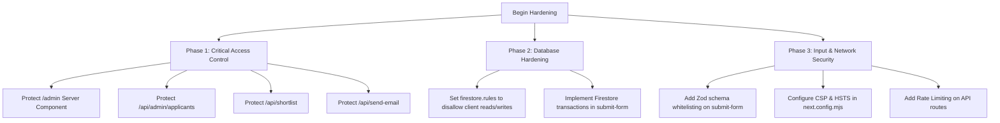

# Comprehensive OWASP Web Security Audit & Remediation Guide

## Overview

This security audit and code review was conducted across the recruitment portal codebase aligned with the **OWASP Top 10 Web Application Security Risks (2021)**. 

The audit evaluated session management, token validation, protected route handling, server components, API route handlers, input sanitization, Firestore database security rules, secret management, client-side data handling, and HTTP security headers.

While public-facing candidate forms incorporate client-side validation and session checks on submission, the audit identified **multiple critical vulnerabilities**—most notably that the `/admin` portal and its backing APIs lack server-side authorization guards, allowing unauthenticated attackers to dump confidential applicant data, modify applicant statuses, send arbitrary emails via an open relay, and bypass database security rules.

---

## Executive Vulnerability Matrix

| ID | Vulnerability Finding | OWASP Category | Severity | Target File(s) |
| :--- | :--- | :--- | :--- | :--- |
| **SEC-01** | SSR Data Leakage on Unprotected `/admin` Page | **A01:2021 – Broken Access Control** | **CRITICAL** | [`app/(pages)/admin/page.jsx`](file:///c:/Users/saksh/Desktop/gdg/app/%28pages%29/admin/page.jsx#L8-L23) |
| **SEC-02** | Unauthenticated Applicant Data Dump API | **A01:2021 – Broken Access Control** | **CRITICAL** | [`app/api/admin/applicants/route.js`](file:///c:/Users/saksh/Desktop/gdg/app/api/admin/applicants/route.js#L6-L24) |
| **SEC-03** | Unauthenticated Shortlisting Modification API | **A01:2021 – Broken Access Control** | **CRITICAL** | [`app/api/shortlist/[id]/route.js`](file:///c:/Users/saksh/Desktop/gdg/app/api/shortlist/%5Bid%5D/route.js#L4-L30) |
| **SEC-04** | Open Unauthenticated Email Relay / Phishing Proxy | **A01:2021 / A04:2021 – Insecure Design** | **CRITICAL** | [`app/api/send-email/route.js`](file:///c:/Users/saksh/Desktop/gdg/app/api/send-email/route.js#L13-L72) |
| **SEC-05** | Firestore Security Rules: Public World Read/Write | **A05:2021 – Security Misconfiguration** | **CRITICAL** | [`firestore.rules`](file:///c:/Users/saksh/Desktop/gdg/firestore.rules#L1-L8) |
| **SEC-06** | Mass Assignment & NoSQL Field Injection | **A03:2021 – Injection** | **HIGH** | [`app/api/submit-form/route.js`](file:///c:/Users/saksh/Desktop/gdg/app/api/submit-form/route.js#L36-L97) |
| **SEC-07** | Missing HTTP Security Headers (CSP, HSTS, X-Frame) | **A05:2021 – Security Misconfiguration** | **HIGH** | [`next.config.mjs`](file:///c:/Users/saksh/Desktop/gdg/next.config.mjs#L1-L9) |
| **SEC-08** | Missing Rate Limiting Across Auth & State-Altering Endpoints | **A04:2021 – Insecure Design** | **HIGH** | Global Route Handlers |
| **SEC-09** | Application Limit Bypass via Concurrent Race Condition | **A04:2021 – Insecure Design** | **MEDIUM** | [`app/api/submit-form/route.js`](file:///c:/Users/saksh/Desktop/gdg/app/api/submit-form/route.js#L54-L97) |
| **SEC-10** | Database Internal Error Leakage & Verbose Responses | **A05:2021 – Security Misconfiguration** | **LOW** | [`app/api/shortlist/[id]/route.js`](file:///c:/Users/saksh/Desktop/gdg/app/api/shortlist/%5Bid%5D/route.js#L28) |
| **SEC-11** | Missing Cross-Origin Request Validation on State Endpoints | **A01:2021 – Broken Access Control** | **MEDIUM** | State-altering API Handlers |
| **SEC-12** | Local Key File Presence & Storage Protocol | **A07:2021 – Identification Failures** | **LOW** | Project Root / Deployment |

---

## Detailed Vulnerability Analysis & Solutions

---

### SEC-01: SSR Data Leakage on Unprotected `/admin` Page

#### What Was Found
In [`app/(pages)/admin/page.jsx`](file:///c:/Users/saksh/Desktop/gdg/app/%28pages%29/admin/page.jsx#L8-L23):
```javascript
export default async function AdminPage() {
  const db = await connect();
  const snapshot = await db.collection("formData").get();
  const applicants = snapshot.docs.map((doc) => ({
    id: doc.id,
    _id: doc.id,
    ...serializeFirestoreData(doc.data()),
  }));

  return (
    <main>
      <NavBar />
      <AdminContent applicants={applicants} />
    </main>
  );
}
```
`AdminContent` is a client component (`"use client"`) that conditionally displays an `UnauthorizedView` or `AccessDenied` card if `authClient.useSession()` indicates that the user is not signed in or does not have `role === "admin"`.

#### Threat & Impact
**Catastrophic Information Disclosure.**
In Next.js React Server Components (RSC), all props passed from a Server Component to a Client Component are serialized directly into the initial HTML document payload (within `<script>` tags and the RSC flight stream). 

Even though the browser visually renders the "Access Denied" card to an unauthorized user, **every applicant's personal data** (full names, personal email addresses, phone numbers, registration numbers, departments, preferences, and questionnaire responses) is already sent across the network in plaintext. Any visitor can run `curl http://localhost:3000/admin` or inspect the page source to harvest the entire applicant database without authenticating.

#### Technical Solution
Enforce server-side session authentication and admin role authorization in `AdminPage` before executing any database queries. If the user is unauthenticated or not an admin, immediately redirect to sign-in or return a 403 Forbidden response.

```javascript
// app/(pages)/admin/page.jsx
import React from "react";
import NavBar from "@/components/NavBar";
import { connect, serializeFirestoreData } from "@/lib/db";
import AdminContent from "@/components/AdminContent";
import { auth } from "@/lib/auth";
import { headers } from "next/headers";
import { redirect } from "next/navigation";

export const dynamic = "force-dynamic";

export default async function AdminPage() {
  const reqHeaders = await headers();
  const session = await auth.api.getSession({
    headers: reqHeaders,
  });

  // Verify authentication and administrator role strictly on the server
  if (!session?.user) {
    redirect("/auth/signin?callbackUrl=/admin");
  }

  if (session.user.role !== "admin") {
    redirect("/?error=unauthorized");
  }

  // Only query database once access is verified
  const db = await connect();
  const snapshot = await db.collection("formData").get();
  const applicants = snapshot.docs.map((doc) => ({
    id: doc.id,
    _id: doc.id,
    ...serializeFirestoreData(doc.data()),
  }));

  return (
    <main>
      <NavBar />
      <AdminContent applicants={applicants} />
    </main>
  );
}
```

---

### SEC-02: Unauthenticated Applicant Data Dump API

#### What Was Found
In [`app/api/admin/applicants/route.js`](file:///c:/Users/saksh/Desktop/gdg/app/api/admin/applicants/route.js#L6-L24):
```javascript
export async function GET() {
  try {
    const db = await connect();
    const snapshot = await db.collection("formData").get();
    const applicants = snapshot.docs.map((doc) => ({
      id: doc.id,
      _id: doc.id,
      ...serializeFirestoreData(doc.data()),
    }));

    return NextResponse.json({ applicants });
  } catch (error) { ... }
}
```

#### Threat & Impact
**Complete Data Exposure.**
The endpoint has zero authentication and zero role checks. Any automated web crawler, attacker, or rival candidate can issue a `GET /api/admin/applicants` request to retrieve all candidate submission documents.

#### Technical Solution
Implement server-side session and role verification:

```javascript
// app/api/admin/applicants/route.js
import { connect, serializeFirestoreData } from "@/lib/db";
import { auth } from "@/lib/auth";
import { headers } from "next/headers";
import { NextResponse } from "next/server";

export const dynamic = "force-dynamic";

export async function GET() {
  try {
    const session = await auth.api.getSession({
      headers: await headers(),
    });

    if (!session?.user) {
      return NextResponse.json(
        { error: "Authentication required" },
        { status: 401 }
      );
    }

    if (session.user.role !== "admin") {
      return NextResponse.json(
        { error: "Forbidden: Admin privileges required" },
        { status: 403 }
      );
    }

    const db = await connect();
    const snapshot = await db.collection("formData").get();
    const applicants = snapshot.docs.map((doc) => ({
      id: doc.id,
      _id: doc.id,
      ...serializeFirestoreData(doc.data()),
    }));

    return NextResponse.json({ applicants }, { status: 200 });
  } catch (error) {
    console.error("Error fetching applicants:", error);
    return NextResponse.json(
      { error: "Failed to fetch applicants" },
      { status: 500 }
    );
  }
}
```

---

### SEC-03: Unauthenticated Shortlisting Modification API

#### What Was Found
In [`app/api/shortlist/[id]/route.js`](file:///c:/Users/saksh/Desktop/gdg/app/api/shortlist/%5Bid%5D/route.js#L4-L30):
```javascript
export async function PATCH(req, { params }) {
    const db = await connect();
    const { id } = params;
    const { shortlisted } = await req.json();

    try {
        const docRef = db.collection('formData').doc(id);
        await docRef.update({ shortlisted });
        ...
```

#### Threat & Impact
**Unauthorized Data Tampering.**
Any unauthenticated actor can send a `PATCH /api/shortlist/<applicant_id>` with `{ "shortlisted": true }` or `{ "shortlisted": false }` to arbitrarily manipulate candidate outcomes. Furthermore, the `shortlisted` parameter is unvalidated and accepts any type or injected property.

#### Technical Solution
1. Enforce admin role authentication via `auth.api.getSession`.
2. Validate that `shortlisted` is strictly a boolean.
3. Validate and sanitize document ID parameters.

```javascript
// app/api/shortlist/[id]/route.js
import { NextResponse } from "next/server";
import { connect, serializeFirestoreData } from "@/lib/db";
import { auth } from "@/lib/auth";
import { headers } from "next/headers";

export async function PATCH(req, { params }) {
  try {
    const session = await auth.api.getSession({
      headers: await headers(),
    });

    if (!session?.user || session.user.role !== "admin") {
      return NextResponse.json(
        { success: false, message: "Forbidden: Admin privileges required" },
        { status: 403 }
      );
    }

    const resolvedParams = await params;
    const id = resolvedParams?.id;
    if (!id || typeof id !== "string") {
      return NextResponse.json(
        { success: false, message: "Invalid applicant ID" },
        { status: 400 }
      );
    }

    const body = await req.json();
    if (typeof body.shortlisted !== "boolean") {
      return NextResponse.json(
        { success: false, message: "Invalid 'shortlisted' parameter: must be a boolean" },
        { status: 400 }
      );
    }

    const db = await connect();
    const docRef = db.collection("formData").doc(id);
    const snapshot = await docRef.get();

    if (!snapshot.exists) {
      return NextResponse.json(
        { success: false, message: "Applicant not found" },
        { status: 404 }
      );
    }

    await docRef.update({
      shortlisted: body.shortlisted,
      updatedAt: new Date(),
    });

    return NextResponse.json({
      success: true,
      data: {
        id: snapshot.id,
        _id: snapshot.id,
        ...serializeFirestoreData(snapshot.data()),
        shortlisted: body.shortlisted,
      },
    });
  } catch (error) {
    console.error("Error updating applicant:", error);
    return NextResponse.json(
      { success: false, message: "Internal server error" },
      { status: 500 }
    );
  }
}
```

---

### SEC-04: Open Unauthenticated Email Relay / Phishing Proxy

#### What Was Found
In [`app/api/send-email/route.js`](file:///c:/Users/saksh/Desktop/gdg/app/api/send-email/route.js#L13-L72):
```javascript
export async function POST(req) {
    const { recipients, payloadData } = await req.json();

    if (!recipients || recipients.length === 0) { ... }

    try {
        for (const recipient of recipients) {
            ...
            const mailOptions = {
                from: process.env.EMAIL_USERNAME,
                to: recipient.Email,
                subject: payloadData.subject,
                html: generalTemp,
            };
            await transporter.sendMail(mailOptions);
        }
        ...
```

#### Threat & Impact
**Critical Open Email Relay & Phishing Conduit.**
The endpoint accepts arbitrary `recipients` and arbitrary `payloadData` without any authentication. 
- An attacker can use this endpoint to send phishing emails, scam campaigns, or malware links directly from the organization's verified Gmail account (`EMAIL_USERNAME`).
- Attackers can cause massive financial or operational disruption, Gmail account suspension, and immediate IP/domain reputation blacklisting.

#### Technical Solution
1. Require an authenticated session with `session.user.role === "admin"`.
2. Do not accept arbitrary recipient email addresses from the client. Verify candidate IDs against the database.
3. Validate subjects and body lengths, and sanitize the HTML body to prevent malicious script or link injection.

```javascript
// app/api/send-email/route.js
import { NextResponse } from "next/server";
import nodemailer from "nodemailer";
import { auth } from "@/lib/auth";
import { headers } from "next/headers";
import { connect } from "@/lib/db";

const transporter = nodemailer.createTransport({
  service: "gmail",
  auth: {
    user: process.env.EMAIL_USERNAME,
    pass: process.env.EMAIL_PASSWORD,
  },
});

export async function POST(req) {
  try {
    const session = await auth.api.getSession({
      headers: await headers(),
    });

    if (!session?.user || session.user.role !== "admin") {
      return NextResponse.json(
        { error: "Forbidden: Admin privileges required" },
        { status: 403 }
      );
    }

    const { recipients, payloadData } = await req.json();

    if (!Array.isArray(recipients) || recipients.length === 0) {
      return NextResponse.json(
        { error: "Valid recipients list is required" },
        { status: 400 }
      );
    }

    if (!payloadData?.subject || !payloadData?.body) {
      return NextResponse.json(
        { error: "Subject and email body are required" },
        { status: 400 }
      );
    }

    // Limit maximum batch size per request to prevent resource exhaustion
    if (recipients.length > 50) {
      return NextResponse.json(
        { error: "Recipient batch size exceeds maximum limit of 50" },
        { status: 400 }
      );
    }

    const emailRegex = /^[^\s@]+@[^\s@]+\.[^\s@]+$/;
    for (const recipient of recipients) {
      if (!recipient.Email || !emailRegex.test(recipient.Email)) {
        continue;
      }

      const sanitizedSubject = String(payloadData.subject).slice(0, 150);
      let content = String(payloadData.body)
        .replace(/#name/g, recipient.Name || "Candidate")
        .replace(/#dept/g, recipient.Department || "Department");

      const mailOptions = {
        from: `GDG Recruitment <${process.env.EMAIL_USERNAME}>`,
        to: recipient.Email,
        subject: sanitizedSubject,
        html: `<div>${content}</div>`,
      };

      await transporter.sendMail(mailOptions);
    }

    return NextResponse.json({ message: "Emails dispatched successfully" }, { status: 200 });
  } catch (error) {
    console.error("Email dispatch failure:", error);
    return NextResponse.json({ error: "Failed to dispatch emails" }, { status: 500 });
  }
}
```

---

### SEC-05: Firestore Security Rules: Public World Read/Write

#### What Was Found
In [`firestore.rules`](file:///c:/Users/saksh/Desktop/gdg/firestore.rules#L1-L8):
```javascript
rules_version = '2';
service cloud.firestore {
  match /databases/{database}/documents {
    match /{document=**} {
      allow read, write: if true;
    }
  }
}
```

#### Threat & Impact
**Direct Database Compromise.**
The rule `allow read, write: if true;` exposes the entire Firestore database to any client using the Firebase Web SDK or REST API. Because the project ID and client credentials (`NEXT_PUBLIC_FIREBASE_API_KEY`) are public, anyone can bypass all Next.js API endpoints and directly:
- Read all candidate applications and user passwords/sessions.
- Drop or overwrite all collections.
- Inject fake administrative users.

#### Technical Solution
Because this application handles all database queries on the server via `firebase-admin` (which uses service account credentials and automatically bypasses client security rules), client-side access should be completely locked down:

```javascript
// firestore.rules
rules_version = '2';
service cloud.firestore {
  match /databases/{database}/documents {
    match /{document=**} {
      // Reject all direct client reads and writes; server-side Firebase Admin SDK retains full access
      allow read, write: if false;
    }
  }
}
```

---

### SEC-06: Mass Assignment & NoSQL Field Injection

#### What Was Found
In [`app/api/submit-form/route.js`](file:///c:/Users/saksh/Desktop/gdg/app/api/submit-form/route.js#L36-L97):
```javascript
const { Department, Questions, ...formFields } = data;
...
const cleanFields = {};
for (const [fKey, fVal] of Object.entries(formFields)) {
  cleanFields[fKey] = fVal !== undefined && fVal !== null ? fVal : "";
}

await collection.add({
  ...cleanFields,
  Department,
  Questions: cleanQuestions,
  Email: userEmail,
  createdAt: new Date(),
});
```

#### Threat & Impact
**Mass Assignment / Attribute Overwrite.**
The handler takes any key submitted in the body and adds it to the Firestore document. A malicious applicant can post `{ "shortlisted": true, "role": "admin", "interviewPassed": true }` to elevate their candidate status or pollute database documents.

#### Technical Solution
Implement strict field whitelisting using Zod on the server route. Discard all non-whitelisted fields:

```javascript
// app/api/submit-form/route.js
import * as z from "zod";

const FormSubmissionSchema = z.object({
  Name: z.string().trim().min(1, "Name is required").max(100),
  RegistrationNumber: z.string().trim().regex(/^\d{2}[A-Za-z]{3}\d{4}$/, "Invalid registration number"),
  Phone: z.string().trim().regex(/^\d{10}$/, "Phone must be exactly 10 digits"),
  Gender: z.string().max(20).optional().default(""),
  "Year of Study": z.string().max(20).optional().default(""),
  "Why do you want to join Organization Name?": z.string().max(2500).optional().default(""),
  Department: z.string().min(1).max(50),
  Questions: z.record(z.string(), z.string()).optional().default({}),
});

// Inside POST handler:
const parsed = FormSubmissionSchema.safeParse(await req.json());
if (!parsed.success) {
  return new Response(JSON.stringify({ message: parsed.error.errors[0].message }), {
    status: 400,
    headers: { "Content-Type": "application/json" },
  });
}

const validData = parsed.data;

// Explicit object construction prevents field injection:
await collection.add({
  Name: validData.Name,
  RegistrationNumber: validData.RegistrationNumber.toUpperCase(),
  Phone: validData.Phone,
  Gender: validData.Gender,
  "Year of Study": validData["Year of Study"],
  "Why do you want to join Organization Name?": validData["Why do you want to join Organization Name?"],
  Department: validData.Department,
  Questions: validData.Questions,
  Email: userEmail,
  shortlisted: false, // Enforce default state explicitly
  createdAt: new Date(),
});
```

---

### SEC-07: Missing HTTP Security Headers

#### What Was Found
In [`next.config.mjs`](file:///c:/Users/saksh/Desktop/gdg/next.config.mjs):
```javascript
/** @type {import('next').NextConfig} */
const nextConfig = {
    images: {
        domains: ["avatar.vercel.sh"],
    },
};

export default nextConfig;
```
The application has no Content Security Policy (CSP), Strict-Transport-Security (HSTS), X-Frame-Options, X-Content-Type-Options, or Referrer-Policy configured.

#### Threat & Impact
- Susceptibility to clickjacking (embedding the portal in an `<iframe>`).
- MIME-type sniffing attacks.
- Lack of HSTS leaves users susceptible to SSL-stripping on unsecured networks.

#### Technical Solution
Update `next.config.mjs` with production-grade headers and modernize image remote patterns:

```javascript
// next.config.mjs
/** @type {import('next').NextConfig} */
const nextConfig = {
  images: {
    remotePatterns: [
      {
        protocol: "https",
        hostname: "avatar.vercel.sh",
      },
    ],
  },
  async headers() {
    return [
      {
        source: "/(.*)",
        headers: [
          {
            key: "X-Content-Type-Options",
            value: "nosniff",
          },
          {
            key: "X-Frame-Options",
            value: "DENY",
          },
          {
            key: "X-XSS-Protection",
            value: "1; mode=block",
          },
          {
            key: "Referrer-Policy",
            value: "strict-origin-when-cross-origin",
          },
          {
            key: "Strict-Transport-Security",
            value: "max-age=63072000; includeSubDomains; preload",
          },
          {
            key: "Permissions-Policy",
            value: "camera=(), microphone=(), geolocation=()",
          },
        ],
      },
    ];
  },
};

export default nextConfig;
```

---

### SEC-08: Missing Rate Limiting Across Auth & Sensitive APIs

#### What Was Found
No rate limiting or request throttling is configured across the application.

#### Threat & Impact
1. **Authentication Brute-Forcing:** `/api/auth/sign-in` can be targeted with automated password-guessing or credential-stuffing dictionaries.
2. **Form Flooding:** Malicious scripts can repeatedly post to `/api/submit-form` or hammer `/api/check-applications`, degrading database performance.

#### Technical Solution
Create an in-memory sliding-window rate limiter utility (or connect Upstash Redis in serverless production) and apply it to sensitive endpoints:

```javascript
// lib/rate-limit.js
const trackers = new Map();

export function rateLimit({ interval = 60000, maxRequests = 10 } = {}) {
  return {
    check: (identifier) => {
      const now = Date.now();
      const client = trackers.get(identifier) || [];
      const windowStart = now - interval;
      const recentRequests = client.filter((timestamp) => timestamp > windowStart);

      if (recentRequests.length >= maxRequests) {
        return { success: false, remaining: 0 };
      }

      recentRequests.push(now);
      trackers.set(identifier, recentRequests);
      return { success: true, remaining: maxRequests - recentRequests.length };
    },
  };
}
```

Apply to `app/api/submit-form/route.js`:
```javascript
const limiter = rateLimit({ interval: 60000, maxRequests: 5 });

export async function POST(req) {
  const ip = req.headers.get("x-forwarded-for") || "anonymous";
  const { success } = limiter.check(ip);
  if (!success) {
    return new Response(JSON.stringify({ message: "Too many requests. Please try again in a minute." }), {
      status: 429,
      headers: { "Content-Type": "application/json" },
    });
  }
  ...
}
```

---

### SEC-09: Application Limit Bypass via Concurrent Race Condition

#### What Was Found
In [`app/api/submit-form/route.js`](file:///c:/Users/saksh/Desktop/gdg/app/api/submit-form/route.js#L54-L97):
```javascript
const existingSubmissions = await collection.where("Email", "==", userEmail).get();
if (existingSubmissions.size >= 2) {
  return new Response(...);
}
...
await collection.add({ ... });
```

#### Threat & Impact
**Time-of-Check to Time-of-Use (TOCTOU) Flaw.**
If an applicant dispatches multiple concurrent POST requests simultaneously (e.g., using `Promise.all` or an automated script), all requests perform the read query before any write has committed. All concurrent checks pass `existingSubmissions.size < 2`, allowing the candidate to submit 3 or more applications.

#### Technical Solution
Use a deterministic composite document ID or execute the check and insert inside a Firestore transaction:

```javascript
const sanitizedEmail = userEmail.replace(/[^a-zA-Z0-9]/g, "_");
const sanitizedDept = Department.replace(/[^a-zA-Z0-9]/g, "_");
const submissionDocId = `${sanitizedEmail}_${sanitizedDept}`;

const docRef = collection.doc(submissionDocId);

await db.runTransaction(async (transaction) => {
  const existingDocs = await transaction.get(collection.where("Email", "==", userEmail));
  
  if (existingDocs.size >= 2) {
    throw new Error("Maximum application limit of 2 reached.");
  }

  const existingDeptDoc = await transaction.get(docRef);
  if (existingDeptDoc.exists) {
    throw new Error(`You have already submitted an application for ${Department}`);
  }

  transaction.set(docRef, {
    ...cleanFields,
    Department,
    Email: userEmail,
    createdAt: new Date(),
  });
});
```

---

### SEC-10: Database Error Leakage & Verbose Responses

#### What Was Found
- In [`app/api/shortlist/[id]/route.js`](file:///c:/Users/saksh/Desktop/gdg/app/api/shortlist/%5Bid%5D/route.js#L28):
  ```javascript
  return NextResponse.json({ success: false, message: error.message }, { status: 400 });
  ```
- In [`app/api/check-applications/route.js`](file:///c:/Users/saksh/Desktop/gdg/app/api/check-applications/route.js#L53):
  ```javascript
  return NextResponse.json({ message: "Internal server error inside check-applications dir" }, { status: 500 });
  ```

#### Threat & Impact
Leaking raw exception strings from underlying drivers reveals internal database schema constraints, field names, and infrastructure details to attackers.

#### Technical Solution
Log error stacks to server-side stdout and return sanitized, generic error responses to the client:
```javascript
// Return generic message
return NextResponse.json(
  { success: false, message: "An unexpected error occurred while processing your request." },
  { status: 500 }
);
```

---

### SEC-11: CSRF & Cross-Origin Request Validation

#### What Was Found
Next.js route handlers (`POST`, `PATCH`) rely on cookie credentials without validating origin headers on state changes.

#### Technical Solution
Add Origin/Referer verification helper on state-altering endpoints:
```javascript
export function verifyOrigin(req) {
  const origin = req.headers.get("origin");
  const host = req.headers.get("host");
  if (origin && !origin.includes(host)) {
    return false;
  }
  return true;
}
```

---

### SEC-12: Service Account Secrets & Environment Protocol

#### What Was Found
`gdg-recruitment-cbd71-7e7c3fb1872b.json` was situated in the project root. While `.gitignore` appropriately ignores it (`gdg-recruitment-*.json`), storing service account JSON files on local disk creates risks of accidental leakage through archives, zip exports, or shared snapshots.

#### Technical Solution
1. In hosting providers (Vercel / Cloud Run), supply credentials purely through encrypted environment variables:
   - `FIREBASE_PROJECT_ID`
   - `FIREBASE_CLIENT_EMAIL`
   - `FIREBASE_PRIVATE_KEY`
2. Remove any local `.json` credentials once environment variables are confirmed.

---

## Action Plan & Remediation Roadmap



1. **Immediate (P0):**
   - Apply server-side session and admin checks to [`app/(pages)/admin/page.jsx`](file:///c:/Users/saksh/Desktop/gdg/app/%28pages%29/admin/page.jsx), [`app/api/admin/applicants/route.js`](file:///c:/Users/saksh/Desktop/gdg/app/api/admin/applicants/route.js), [`app/api/shortlist/[id]/route.js`](file:///c:/Users/saksh/Desktop/gdg/app/api/shortlist/%5Bid%5D/route.js), and [`app/api/send-email/route.js`](file:///c:/Users/saksh/Desktop/gdg/app/api/send-email/route.js).
   - Change [`firestore.rules`](file:///c:/Users/saksh/Desktop/gdg/firestore.rules) to `allow read, write: if false;`.
2. **High Priority (P1):**
   - Implement field whitelisting on [`app/api/submit-form/route.js`](file:///c:/Users/saksh/Desktop/gdg/app/api/submit-form/route.js).
   - Inject security headers via [`next.config.mjs`](file:///c:/Users/saksh/Desktop/gdg/next.config.mjs).
3. **Medium Priority (P2):**
   - Introduce rate limiting to guard authentication and application submissions.
   - Enforce transactions on application submissions to prevent race condition bypasses.
